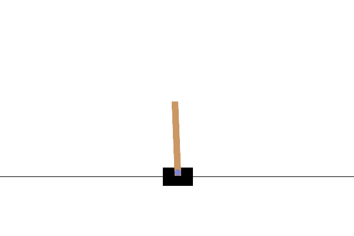

# 第0章 動作確認：CartPole をでたらめに動かした様子

[第0章の Notebook](ch00_setup_check.ipynb) の4節で作った GIF です。GitHub では Notebook の中の GIF の動きが見られないため（著者が、private だった 2026-10-01 に第0章で、public にした後の 2026-10-10 に第3〜5章で確かめました）、このページで見られるようにしています。

台車を、毎回でたらめに左右へ押した様子です（seed = 0）。棒は少しずつ左へ傾き、18 回動かしたところで、傾きが ±12 度（赤い線）を超えて「倒れた」と判定され、エピソードが終わります（`FAIL` と表示して1秒止めます）。

そのあとの、棒が大きく倒れていく様子（`after end (ref.)`）は、失敗が一目で分かるように、判定で終わったあとも絵を作るためだけに物理の計算を続けた参考の絵です。本来のエピソードには含まれません。GIF は、実際の CartPole の時間（1回の行動あたり 0.02 秒）の5倍ゆっくり再生しています。

CartPole の仕様（1回の行動あたり 0.02 秒など）の出典は、[第0章の Notebook](ch00_setup_check.ipynb) の末尾の「出典」の節にあります。絵は、Gymnasium（MIT License）の CartPole の描画処理が出力したものに、著者が Pillow で線と文字を書き込んだものです。ライセンスは、リポジトリの [LICENSE.md](../../LICENSE.md) を見てください。
