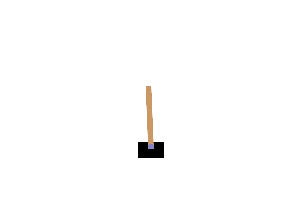

# 第1章 動かして楽しむ：学習の前と後の CartPole

[第1章の Notebook](ch01_first_training.ipynb) の5節で作った GIF です。著者が第0章で確かめたところ、GitHub の private リポジトリでは Notebook の中の GIF が表示されなかったため（2026-10-01）、このページで見られるようにしています。

## 学習前

PPO のモデルを作った直後、まだ何も学習していないエージェントです（seed = 0）。棒が少しずつ左へ傾いていき、70 回動かしたところで、傾きが ±12 度（赤い線）を超えて「倒れた」と判定され、エピソードが終わります（`FAIL` と表示して1秒止めます）。

そのあとの、棒が大きく倒れていく様子（`after end (ref.)`）は、失敗が一目で分かるように、判定で終わったあとも絵を作るためだけに物理の計算を続けた参考の絵です（このあいだの行動は、方策ではなく左右交互に押しています。学習前の方策のままでは、台車が画面の外へ出てしまい、棒が倒れる様子が写らなかったためです。左右交互に押しても、それまでの勢いで台車は左へ動いていきます）。本来のエピソードには含まれません。1 枚を 100 ミリ秒で表示しているので、実際の CartPole の時間（1回の行動あたり 0.02 秒）の5倍ゆっくり再生しています。

## 学習後

PPO で 30,000 ステップ学習させた後のエージェントです（seed = 0）。上限の 500 回まで、棒をほぼまっすぐに保ち続けます。5 回の行動ごとに1枚を記録し、1 枚を 100 ミリ秒で表示しているので、ほぼ実際の速さで再生しています。

CartPole の仕様の出典は、[第1章の Notebook](ch01_first_training.ipynb) の末尾の「出典」の節にあります。絵は、Gymnasium（MIT License）の CartPole の描画処理が出力したものです。学習前の GIF には、著者が Pillow で線と文字を書き込んでいます。ライセンスは、リポジトリの [LICENSE.md](../../LICENSE.md) を見てください。
