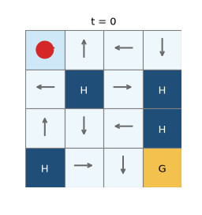

# 第3章 FrozenLake：学習後のエージェントが湖を渡る様子

[第3章の Notebook](ch03_frozenlake.ipynb) の4-3節で作った GIF です。著者が第0章で確かめたところ、GitHub の private リポジトリでは Notebook の中の GIF が表示されなかったため（2026-10-01）、このページで見られるようにしています。

## 学習後（Q学習で 5,000 回のエピソードを経験した後）

赤い丸がエージェント、矢印が学習後の方策が各マスで選ぶ向きです。紺のマスは穴、黄色のマスはゴールです。`seed` を 0 から順に試して、最初にゴールに着いた回（seed = 1）を記録しました。

最初の 35 回は、左上の 0・4・8 のマスの間を行ったり来たりしています。0 と 4 では左（湖の端）を選び続けるので、その場にとどまるか、上下へ滑るだけで、右隣の穴には落ちません。そのあと 8 → 9 → 13 → 14 と進み、41 回目に、14 で下を選んだときに右へ滑ってゴールに着きます。1 枚を 300 ミリ秒で表示し、ゴールに着いた所で少し止めています。

湖の地図と仕様の出典は、[第3章の Notebook](ch03_frozenlake.ipynb) の末尾の「出典」の節にあります。絵は、著者が matplotlib で描いたものです（Gymnasium の描画の絵は使っていません）。ライセンスは、リポジトリの [LICENSE.md](../../LICENSE.md) を見てください。
