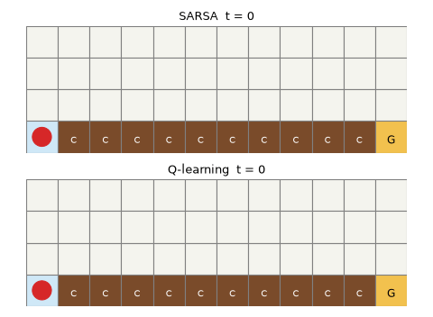

# 第4章 CliffWalking：SARSA と Q学習が学んだ道を歩く様子

[第4章の Notebook](ch04_cliffwalking.ipynb) の4-3節で作った GIF です。著者が第0章で確かめたところ、GitHub の private リポジトリでは Notebook の中の GIF が表示されなかったため（2026-10-01）、このページで見られるようにしています。

## 学習後（それぞれエピソードを 500 回経験した後）

上が SARSA、下が Q学習で、学習した Q 表から Q 値が最大の行動を選び、でたらめな行動を混ぜずに歩かせています。赤い丸がエージェント、線が通った道です。茶色の `C` のマスが崖、黄色の `G` のマスがゴールです。

SARSA は、スタートから上へ 2 マス進んで崖から離れ、上から2段目を右へ進んで、15 歩でゴールに着きます。Q学習は、上へ 1 マスだけ進み、崖のすぐ上の段を右へ進んで、最短の 13 歩でゴールに着きます。Q学習が先にゴールに着いたあとは、ゴールで待っています。1 枚を 400 ミリ秒で表示し、2つともゴールに着いた所で少し止めています。

環境の仕様の出典は、[第4章の Notebook](ch04_cliffwalking.ipynb) の末尾の「出典」の節にあります。絵は、著者が matplotlib で描いたものです（Gymnasium の描画の絵は使っていません）。ライセンスは、リポジトリの [LICENSE.md](../../LICENSE.md) を見てください。
