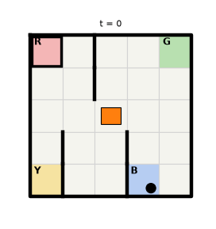

# 第5章 Taxi：学習後のタクシーが客を運ぶ様子

[第5章の Notebook](ch05_taxi.ipynb) の4-3節で作った GIF です。GitHub では Notebook の中の GIF の動きが見られないため（著者が、private だった 2026-10-01 と、public にした後の 2026-10-10 に確かめました）、このページで見られるようにしています。

## 学習後（ε の減衰と行動マスクを使った Q学習で、エピソードを 3,000 回経験した後）

四角がタクシーで、空車のときは橙、客が乗っているときは緑です。黒い丸が乗り場で待つ客、太い枠が客の行き先の乗り場、太い線が壁です。各図の上に、その時点までに選んだ行動を書いています。

タクシーは、東へ1マス、南へ2マス進んで、乗り場 B で客を乗せます。そのあと北へ2マス、西へ3マス、北へ2マス進み、行き先の乗り場 R で客を降ろします。12 回の行動で送り届け、報酬の合計は 9 でした。1 枚を 500 ミリ秒で表示し、送り届けた所で少し止めています。

町の地図と仕様の出典は、[第5章の Notebook](ch05_taxi.ipynb) の末尾の「出典」の節にあります。絵は、著者が matplotlib で描いたものです（Gymnasium の描画の絵は使っていません）。ライセンスは、リポジトリの [LICENSE.md](../../LICENSE.md) を見てください。
