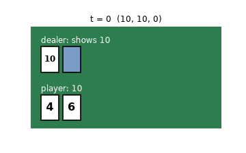

# 第6章 Blackjack：学習後の方策で1回勝負する様子

[第6章の Notebook](ch06_blackjack.ipynb) の4-4節で作った GIF です。GitHub では Notebook の中の GIF の動きが見られないため（著者が、private だった 2026-10-01 に第0章で、public にした後の 2026-10-10 に第3〜5章で確かめました）、このページで見られるようにしています。

## 学習後（ε-greedy のモンテカルロ制御で、200,000 回勝負した後）

上の段がディーラーの手札、下の段がプレイヤーの手札です。ディーラーの2枚目は、プレイヤーが止めるまで裏向き（青い四角）です。各図の上に、その場面を書いています。

プレイヤーの最初の手札は 4 と 6（合計 10）で、ディーラーの表向きの札は 10 です。学習後の方策は2回引き、4 で 14、7 で 21 になって止めます。ディーラーは裏の 4 を見せて合計 14 になり、17 に届かないのでもう1枚引いて、4 で 18 になります。21 対 18 で、プレイヤーの勝ち（報酬 +1）です。1 枚を 1 秒で表示し、結果の所で少し止めています。

ルールと仕様の出典は、[第6章の Notebook](ch06_blackjack.ipynb) の末尾の「出典」の節にあります。絵は、著者が matplotlib で描いたものです（Gymnasium の描画の絵は使っていません）。ライセンスは、リポジトリの [LICENSE.md](../../LICENSE.md) を見てください。
