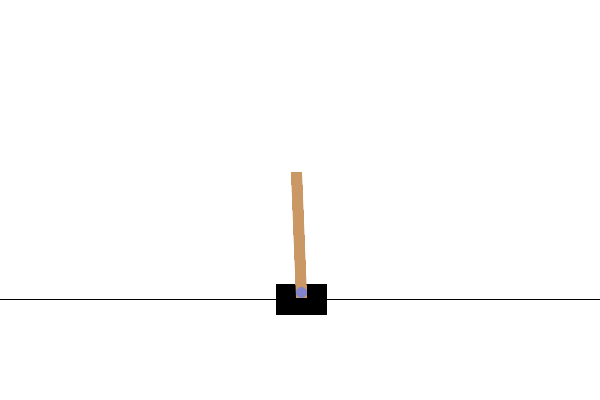

# 第7章 CartPole（DQN）：学習後のエージェントが棒を立てる様子

[第7章の Notebook](ch07_cartpole_dqn.ipynb) の4-3節で作った GIF です。GitHub では Notebook の中の GIF の動きが見られないため（著者が、private だった 2026-10-01 に第0章で、public にした後の 2026-10-10 に第3〜5章で確かめました）、このページで見られるようにしています。

## 学習後（Stable-Baselines3 の DQN で 50,000 ステップ学習し、評価で一番よかった時点のモデル）

台車は真ん中から右へ寄っていき、そのあとは右寄りの位置で、棒をほぼまっすぐに立て続けます。上限の 500 回まで続きました。5 ステップごとの絵を 1 枚 100 ミリ秒で表示しているので、ほぼ実際の速さです。

絵は、Gymnasium（MIT License）の CartPole の描画処理が出力したものです。仕様と出典は、[第7章の Notebook](ch07_cartpole_dqn.ipynb) の末尾の「出典」の節にあります。ライセンスは、リポジトリの [LICENSE.md](../../LICENSE.md) を見てください。
