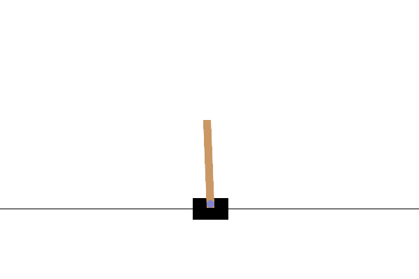

# 第8章 CartPole の続き（方策勾配法）：学習後のエージェントが棒を立てる様子

[第8章の Notebook](ch08_cartpole_reinforce.ipynb) の3-3節で作った GIF です。GitHub では Notebook の中の GIF の動きが見られないため（著者が、private だった 2026-10-01 に第0章で、public にした後の 2026-10-10 に第3〜5章で確かめました）、このページで見られるようにしています。

## 学習後（Stable-Baselines3 の A2C で 500,000 ステップ学習した、最後の時点のモデル）

台車は真ん中からゆっくり左へ動いていき、最後は台車1台分ほど左にいます。その間、棒はほぼまっすぐに立ち続け、上限の 500 回まで続きました。5 ステップごとの絵を 1 枚 100 ミリ秒で表示しているので、ほぼ実際の速さです。

絵は、Gymnasium（MIT License）の CartPole の描画処理が出力したものです。仕様と出典は、[第8章の Notebook](ch08_cartpole_reinforce.ipynb) の末尾の「出典」の節にあります。ライセンスは、リポジトリの [LICENSE.md](../../LICENSE.md) を見てください。
