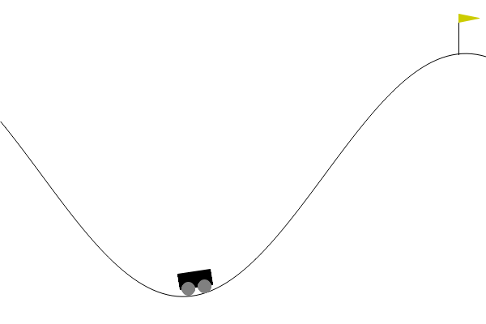
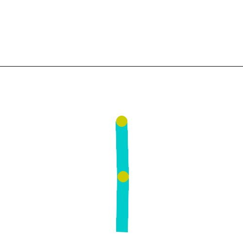

# 第9章 MountainCar／Acrobot：学習後のエージェントが山を登り、振り子を振り上げる様子

[第9章の Notebook](ch09_mountaincar_acrobot.ipynb) の4-3節と6-3節で作った GIF です。GitHub では Notebook の中の GIF の動きが見られないため（著者が、private だった 2026-10-01 に第0章で、public にした後の 2026-10-10 に第3〜5章で確かめました）、このページで見られるようにしています。

## MountainCar（Stable-Baselines3 の DQN で 120,000 ステップ学習した、一番よい時点のモデル）

台車は、はじめに少し右へ動いたあと、左の坂を高くまで登り、そこから坂を下りながら勢いをつけて、右の坂を一気に登って旗に着きます（101 ステップ）。3 ステップごとの絵を 1 枚 100 ミリ秒で表示しているので、ほぼ描画の速さ（1 秒に 30 ステップ）です。

## Acrobot（Stable-Baselines3 の DQN で 30,000 ステップ学習した、一番よい時点のモデル）

振り子は、はじめはまっすぐ下に垂れていて、関節を左右に回すたびに揺れが少しずつ大きくなり、最後に先端が上の灰色の線を越えます（73 ステップ）。2 ステップごとの絵を 1 枚 133 ミリ秒で表示しているので、ほぼ描画の速さ（1 秒に 15 ステップ）です。

絵は、Gymnasium（MIT License）の MountainCar と Acrobot の描画処理が出力したものです。仕様と出典は、[第9章の Notebook](ch09_mountaincar_acrobot.ipynb) の末尾の「出典」の節にあります。ライセンスは、リポジトリの [LICENSE.md](../../LICENSE.md) を見てください。
