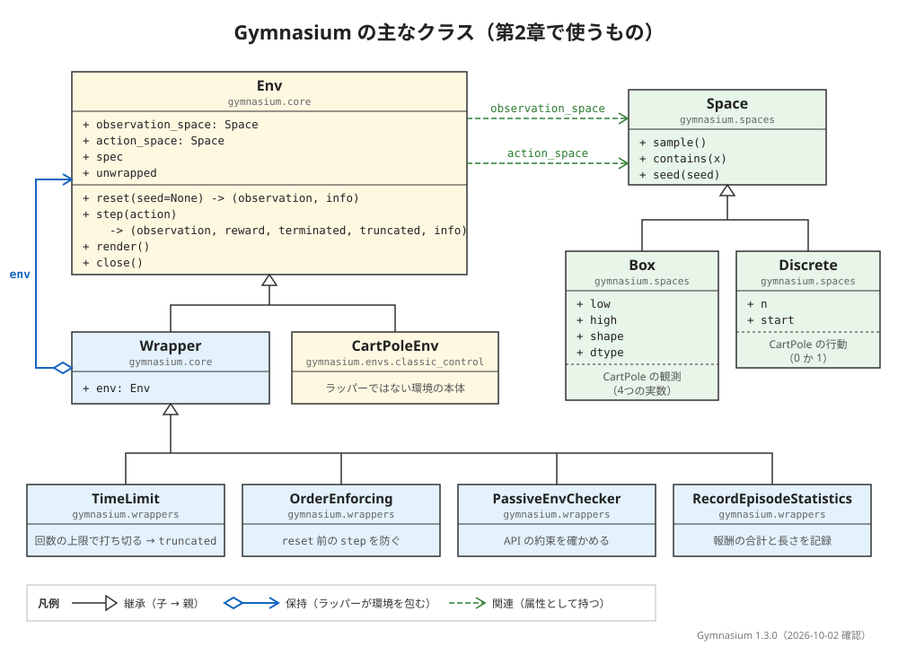

# 概要資料：Gymnasium

第0〜2章では、CartPole を動かし、学習させ、`reset()` と `step()` を手で呼んで中身を確かめてきました。この資料は、そこで触れた Gymnasium の仕組みを1か所にまとめ、これからの章で出会う環境とつなぐための「地図」です。細かな使い方は、各章で実際に動かしながら扱います。ここでは、全体の見取り図と、どの章でどこを使うかをつかんでください。

- **前提**: [第2章 Gymnasium の API の基本](../chapters/ch02_gymnasium_api/ch02_gymnasium_api.ipynb)を終えていること
- **所要の目安**: 読むだけで 10 分ほど。5節のコードは、Notebook の新しいセルに貼り付けて試すこともできます（試さなくても、期待する結果で読めます）

> **注記**: 版と環境の ID は、Gymnasium 1.3.0 で確かめたものです（2026-10-02・2026-10-07 確認）。5節の表示は、著者の環境で実際に確かめたものです。

## 0. この資料で分かること

1. Gymnasium がどんなライブラリで、どこから来たのか
2. この教科書で使う環境と、それを扱う章
3. 環境を動かす基本の操作・空間・ラッパーの関係（第2章の振り返り）
4. 第2章では扱わなかった、ベクトル化環境の考え方

## 1. 全体像

Gymnasium の主なクラスの関係は、次の図のとおりです（第2章で作った[クラス図](../diagrams/gymnasium_classes.md)と同じものです）。



どの環境も `Env` の一種で、`reset()` と `step()` という同じ操作で動かせます。この「どの環境も同じ形で扱える」ことが、Gymnasium のいちばんの価値です。この教科書が、環境を CartPole から FrozenLake、LunarLander へと取り替えながら同じ骨組みで進められるのも、そのおかげです。

## 2. Gymnasium とは

**Gymnasium** は、強化学習の環境を集めて、共通の操作で扱えるようにした Python のライブラリです。もとは OpenAI が公開していた **Gym** というライブラリで、その開発を Farama Foundation という団体が引き継いだものが Gymnasium です。公式の文書は、Gymnasium を「OpenAI の Gym を保守しているフォーク（分かれて開発が続いている版）」と説明しています。

古い記事や本では `import gym` と書かれていることがあります。この教科書では、すべて `import gymnasium as gym` と書きます。

## 3. この教科書で使う環境

Gymnasium の環境は、性質ごとにいくつかの分類にまとめられています。この教科書では、次の環境を、易しいものから順に扱う予定です。ID は Gymnasium 1.3.0 に登録されているものです。

| 分類 | 環境（ID） | 特徴 | 章 |
|---|---|---|---|
| Classic Control | `CartPole-v1` | 台車の上の棒を立てる。行動は2つ | 第0〜2章（済み）、第7〜8章（予定） |
| Toy Text | `FrozenLake-v1` | 凍った湖のマス目を渡る。状態も行動も少ない | 第3章（済み） |
| Toy Text | `CliffWalking-v1` | 崖のそばのマス目を歩く | 第4章（済み） |
| Toy Text | `Taxi-v4` | タクシーで客を運ぶ。状態の数が多い | 第5章（済み） |
| Toy Text | `Blackjack-v1` | トランプのブラックジャック。結果に偶然が入る | 第6章（予定） |
| Classic Control | `MountainCar-v0`・`Acrobot-v1` | 報酬がめったに得られない | 第9章（予定） |
| Classic Control | `Pendulum-v1` | 振り子を立てる。行動が連続の値 | 第10章（予定） |
| Box2D | `LunarLander-v3` | 月面に着陸する | 第11章（予定） |
| Box2D | `BipedalWalker-v3` | 二本足で歩く | 第12章（予定） |
| MuJoCo | `InvertedPendulum-v5`・`Hopper-v5` など | 本格的な物理シミュレーション | 第13章（任意・予定） |

Classic Control と Toy Text は Gymnasium だけで動き、Box2D は環境構築マニュアルで入れた `box2d` を使います。MuJoCo の環境は、ID は登録されていますが、動かすには別のパッケージ（`mujoco`）が要ります（環境構築マニュアルでは入れていません）。公式の文書には、ほかに Atari（ゲーム機のゲーム）や、外部の団体が作った環境の分類もあります。

## 4. 基本の操作・空間・ラッパー（第2章の振り返り）

| 部品 | 役割 | 詳しくは |
|---|---|---|
| `gym.make(ID)` | 環境を作る。本体をラッパーで包んだものが返る | 第2章の2節 |
| `observation_space`・`action_space` | 観測と行動の、形と範囲（空間） | 第2章の3節 |
| `reset(seed=...)` | 最初の状態に戻し、最初の観測と `info` を返す | 第2章の4節 |
| `step(action)` | 1歩進め、観測・報酬・`terminated`・`truncated`・`info` を返す | 第2章の5節 |
| ラッパー | 環境を包んで働きを付け足す（回数の上限、記録など） | 第2章の6節 |
| `render()` | 今の様子を絵にする | 第0章の3節 |

空間には、第2章で見た `Box`（実数の配列）と `Discrete`（0 から始まる整数）のほかに、`MultiBinary`（0 か 1 を並べたもの）、`MultiDiscrete`（整数を並べたもの）、`Text`（文字列）などがあります。この教科書で主に使うのは `Box` と `Discrete` です。

**`render_mode`** は、`gym.make()` のときに、絵をどう出すかを決める指定です。CartPole では `"human"`（別のウィンドウに表示する）と `"rgb_array"`（絵を数値の配列として返す）を選べます。この教科書では、Notebook の中に結果を残すため、`"rgb_array"` を使います。

## 5. ベクトル化環境

**ベクトル化環境**は、同じ環境を何個か並べて、まとめて1歩ずつ進める仕組みです。経験を集める速さを上げるために使います。Gymnasium では `gym.make_vec()` で作れます。

```python
import gymnasium as gym

envs = gym.make_vec("CartPole-v1", num_envs=4, vectorization_mode="sync")
observations, infos = envs.reset(seed=0)
print(type(envs).__name__, envs.num_envs, observations.shape)
envs.close()
```

**期待する結果**:

```text
SyncVectorEnv 4 (4, 4)
```

4つの CartPole が並び、観測は「4つの環境 × 4つの数」の形 `(4, 4)` でまとめて返ってきます。`vectorization_mode="sync"` は、4つの環境を順番に1つずつ進める指定です。`"async"` にすると、別々のプロセスで同時に進めます。

Stable-Baselines3 は、これとは別に、自分のベクトル化環境（`VecEnv`）を持っています。第1章で `PPO` に渡した環境も、内部ではこの形に包まれていました（[Stable-Baselines3 の概要資料](sb3.md)の4節）。

## 出典

この資料は、次の公式の文書と、導入した Gymnasium 1.3.0 の動作（2026-10-02・2026-10-07 確認）をもとに、著者の言葉でまとめたものです。逐語の転載ではありません。

- Farama Foundation, Gymnasium Documentation: https://gymnasium.farama.org/
- Farama Foundation, Gymnasium Documentation, Spaces: https://gymnasium.farama.org/api/spaces/
- Farama Foundation, Gymnasium Documentation, Env: https://gymnasium.farama.org/api/env/

図と文章のライセンスは、リポジトリの [LICENSE.md](../LICENSE.md) を見てください。
