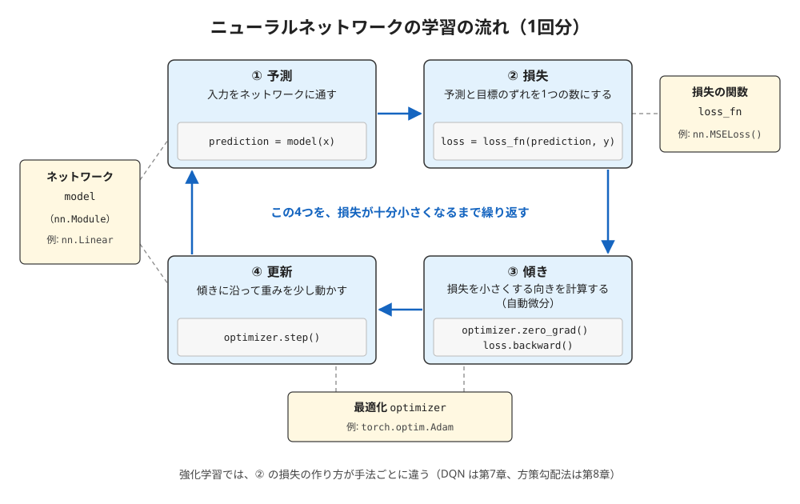

# 概要資料：PyTorch

第1章で使った Stable-Baselines3 の PPO は、方策を小さなニューラルネットワークで表し、その中の計算を **PyTorch** にまかせていました。この教科書でも、第7章（DQN）と第8章（方策勾配法）では、PyTorch で書いた短い解説用のサンプルを読む予定です。この資料は、そのときに困らないように、PyTorch のうち強化学習で使う部分だけを見渡す「地図」です。

- **前提**: [第2章](../chapters/ch02_gymnasium_api/ch02_gymnasium_api.ipynb)を終えていること（3節と4節のコードを試すには、[環境構築マニュアル](../setup/windows_setup.md)で用意した環境が要ります）
- **所要の目安**: 読むだけで 15 分ほど。3節と4節のコードは、Notebook の新しいセルに貼り付けて試すこともできます（試さなくても、期待する結果で読めます）

> **注記**: 3節と4節の「期待する結果」は、著者の環境（Windows 11、CPU のみ、PyTorch 2.14.1）で実際に確かめた表示です（2026-10-07）。GPU での実行は確かめていません（GPU では、4節の小数の値がわずかに変わる可能性があります）。

## 0. この資料で分かること

1. テンソルと装置（CPU / GPU）
2. 自動微分（傾きを自動で計算する仕組み）
3. ニューラルネットワーク・損失・最適化の役割と、学習の基本の流れ

## 1. 全体像



ニューラルネットワークの学習は、次の4つの手順の繰り返しです。

| 手順 | すること | PyTorch の書き方 |
|---|---|---|
| ① 予測 | 入力をネットワークに通して、出力（予測）を得る | `prediction = model(x)` |
| ② 損失 | 予測と目標のずれを、1つの数（損失）にする | `loss = loss_fn(prediction, y)` |
| ③ 傾き | 前の回の傾きを消してから、損失を小さくするには各重みをどちらへ動かせばよいかを計算する | `optimizer.zero_grad()` と `loss.backward()` |
| ④ 更新 | 傾きに沿って、重みを少し動かす | `optimizer.step()` |

強化学習でも、この繰り返しは同じです。違うのは②の損失の作り方です。DQN では「報酬と、次の状態の価値の見積もり」から目標を作り、予測との差を損失にします。方策勾配法では目標は作らず、「得た報酬の合計」を手がかりに、良かった行動を選びやすくなるような損失を作ります（第7章・第8章で扱う予定）。

## 2. テンソルと装置

**テンソル**（`torch.Tensor`）は、PyTorch で数を入れる入れ物です。NumPy の配列とほぼ同じように、数を何次元にも並べて持てます。違いは、次の2つです。

- **装置**を選べる: `tensor.to("cuda")` で GPU に、`tensor.to("cpu")` で CPU に置けます。計算は、同じ装置に置いたテンソルどうしで行います。この教科書では、第0章で見た1行 `device = "cuda" if torch.cuda.is_available() else "cpu"` で装置を選びます
- **傾きを記録できる**: `requires_grad=True` を付けたテンソルは、それを使った計算の流れが記録され、あとで傾きを自動で計算できます（3節）

## 3. 自動微分

**自動微分**（autograd）は、計算の流れを記録しておき、出力をそれぞれの入力で微分した値（傾き）を自動で求める仕組みです。ニューラルネットワークの学習では、「損失を、それぞれの重みで微分した値」を求めるのに使います。

y = x² の、x = 3 での傾きを求めてみます。

```python
import torch

x = torch.tensor(3.0, requires_grad=True)
y = x ** 2
y.backward()
print("y =", y.item(), " dy/dx =", x.grad.item())
```

**期待する結果**:

```text
y = 9.0  dy/dx = 6.0
```

y = x² の傾きは 2x なので、x = 3 では 6 です。`y.backward()` を呼ぶと、記録された計算の流れを逆にたどって傾きが計算され、`x.grad` に入ります。`.item()` は、要素が1つのテンソルから、Python の数を取り出すメソッドです。

## 4. ネットワーク・損失・最適化

1節の4つの手順を、実際に書いてみます。ここでは、直線 y = 2x + 1 の上の点を64個用意し、もっとも小さなネットワーク（入力1つ・出力1つの全結合の層）に、この直線を学ばせます。

```python
import torch
from torch import nn

torch.manual_seed(0)
device = "cuda" if torch.cuda.is_available() else "cpu"

# 入力 x と、正解 y = 2x + 1 を用意する
x = torch.linspace(-1, 1, 64).unsqueeze(1).to(device)
y = 2 * x + 1

model = nn.Linear(1, 1).to(device)
loss_fn = nn.MSELoss()
optimizer = torch.optim.Adam(model.parameters(), lr=0.1)

for step in range(201):
    prediction = model(x)
    loss = loss_fn(prediction, y)
    optimizer.zero_grad()
    loss.backward()
    optimizer.step()
    if step % 50 == 0:
        print(f"step {step:3d}  loss {loss.item():.4f}")

print(f"weight {model.weight.item():.3f}  bias {model.bias.item():.3f}")
```

**期待する結果**（CPU の場合）:

```text
step   0  loss 1.6009
step  50  loss 0.0024
step 100  loss 0.0000
step 150  loss 0.0000
step 200  loss 0.0000
weight 2.000  bias 1.000
```

損失は、始めの 1.6 から、50 回の更新で 0.0024 まで小さくなり、100 回目には（小数第4位までで）0 になります。学習を終えたネットワークの重みは 2.000、切片は 1.000 で、直線 y = 2x + 1 を学べたことが分かります。

コードに出てくる部品の役割は、次のとおりです。

| 部品 | 役割 |
|---|---|
| `nn.Linear(1, 1)` | 全結合の層。入力に重みを掛けて切片を足す（ここでは y = wx + b） |
| `nn.Module` | ネットワークの部品の親クラス。`nn.Linear` も、自分で作るネットワークも、これを継承する。中の重みは `model.parameters()` でまとめて取り出せる |
| `nn.MSELoss()` | 損失の関数。予測と正解の差の2乗の平均（平均二乗誤差） |
| `torch.optim.Adam(..., lr=0.1)` | 最適化の方法。傾きをもとに重みを更新する。`lr` は1回に動かす大きさ（学習率） |
| `optimizer.zero_grad()` | 前の回の傾きを消す。消さないと、傾きが前の回の分に足し合わされていく |
| `torch.manual_seed(0)` | 重みの初期値などの乱数を固定する |
| `unsqueeze(1)` | 64個の数を、「64個 × 1列」の形にする（`nn.Linear` は、入力を「個数 × 入力の数」の形で受け取るため） |

強化学習のネットワークは、層の数や大きさが増え、損失の作り方が変わるだけで、この4つの手順の骨組みは同じです。第1章の PPO の中でも、同じことが行われていました。

## 出典

この資料は、次の公式の文書と、導入した PyTorch 2.14.1 の動作（2026-10-07 確認）をもとに、著者の言葉でまとめたものです。逐語の転載ではありません。

- PyTorch Documentation（2.14）: https://docs.pytorch.org/docs/2.14/index.html
- PyTorch Tutorials, Learn the Basics: https://docs.pytorch.org/tutorials/beginner/basics/intro.html

図と文章のライセンスは、リポジトリの [LICENSE.md](../LICENSE.md) を見てください。
