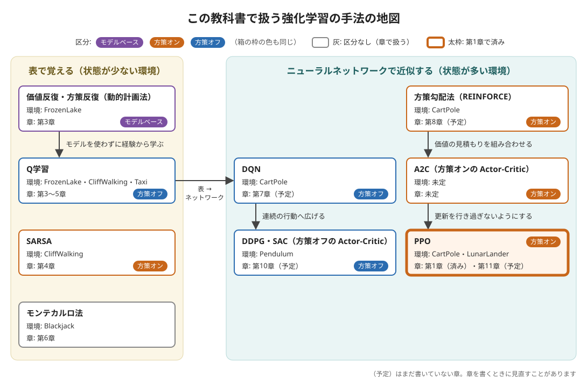

# 概要資料：強化学習

第0〜2章では、CartPole の棒が、でたらめな動きではすぐに倒れ、PPO に学習させると最後まで立ち続けることを見てきました。第2章の最後では、人が1行の規則を書いても棒を立てられることも確かめました。では、強化学習は、どんな考え方で、規則を自分で見つけているのでしょうか。

この資料は、第3章から先で出てくる強化学習の言葉と手法を、ひとつの地図にまとめたものです。ここで全部を理解する必要はありません。各章を読みながら「今どこにいるのか」を確かめるために、何度か戻ってきてください。

- **前提**: [第2章 Gymnasium の API の基本](../chapters/ch02_gymnasium_api/ch02_gymnasium_api.ipynb)を終えていること
- **所要の目安**: 読むだけで 20 分ほど（コードの実行はありません）

> **注記**: 章との対応のうち「予定」と書いたものは、まだ書いていない章です。章を書くときに見直すことがあります。

## 0. この資料で分かること

1. 強化学習の基本の言葉（エージェント・環境・状態・行動・報酬・収益・方策・価値）
2. 強化学習の考え方を分ける3つの軸（探索と活用、モデルフリーとモデルベース、方策オンと方策オフ）
3. この教科書で扱う手法の地図と、それぞれを扱う章

## 1. 全体像

図の矢印は、手法どうしの主なつながりを表しています。たとえば、Q学習の表をニューラルネットワークに置き換えたものが DQN です（「表 → ネットワーク」の矢印）。右の領域には2つの流れがあります。1つは、DQN の考え方（経験の貯め場所や、行動の価値を見積もるネットワーク）を、行動が連続の値の環境へ広げた DDPG・SAC へ進む、方策オフの流れです。もう1つは方策勾配法から、価値の見積もりを組み合わせた A2C を経て、PPO へ進む方策オンの流れです。**Actor-Critic** は、行動を選ぶ部分（Actor）と、状態の価値を見積もる部分（Critic）を組み合わせた手法の総称で、A2C・PPO・DDPG・SAC は、どれもその一種です。箱の枠の色とバッジは、3節で説明する区分（モデルベース・方策オン・方策オフ）です。

この教科書の手法は、次の順に一段ずつ難しくなります。

| 段階 | 手法 | 環境の例 | 章 |
|---|---|---|---|
| 表で覚える | 価値反復・方策反復（動的計画法） | FrozenLake | 第3章（済み） |
| 表で覚える | Q学習・SARSA | FrozenLake・CliffWalking・Taxi・CartPole・MountainCar | 第3章（済み。Q学習）・第4章（済み。SARSA と Q学習）・第5章（済み。Q学習）・第7章（済み。観測を区切った表の Q学習）・第9章（済み。観測を区切った表の Q学習に報酬設計を加える） |
| 表で覚える | モンテカルロ法 | Blackjack | 第6章（済み） |
| ネットワークで近似する | DQN | CartPole・MountainCar・Acrobot | 第7章（済み）・第9章（済み。報酬がまれにしか得られない環境） |
| ネットワークで近似する | 方策勾配法（REINFORCE） | CartPole | 第8章（済み） |
| ネットワークで近似する | A2C（方策オンの Actor-Critic） | CartPole | 第8章（済み。SB3 で動かし、REINFORCE と比べる） |
| ネットワークで近似する | PPO（方策オンの Actor-Critic） | CartPole・LunarLander | 第1章（済み）・第11章（予定） |
| ネットワークで近似する | DDPG・SAC（方策オフの Actor-Critic） | Pendulum | 第10章（済み。SB3 の SAC で動かし、DDPG のサンプルを読み、TD3 とも比べる） |

前半の「表で覚える」手法は、状態と行動の組み合わせが少ない環境で、それぞれの良さを表に書き込んで覚えます。後半の「ネットワークで近似する」手法は、状態が多すぎて表に書ききれない環境（CartPole の観測は連続の値なので、状態は無数にあります）で、表の代わりにニューラルネットワークを使います。

## 2. 基本の言葉

第2章で、エージェントと環境が「観測 → 行動 → 報酬と次の観測」をやり取りすることを見ました。そのやり取りを支える言葉を、CartPole を例にまとめます。

| 言葉 | 意味 | CartPole では |
|---|---|---|
| 状態 | 環境の今のありさま。エージェントは観測を通して状態を知る | 台車の位置・速さ、棒の角度・角速度 |
| 行動 | エージェントが選ぶもの | 左へ押す・右へ押す |
| 報酬 | 1歩ごとに環境が返す、良し悪しの数 | 棒が立っていれば 1 |
| 収益 | エピソードの中で、これから先に得る報酬の合計 | あと何歩、棒が立っていられるか |
| 方策 | 状態を見て、どの行動を選ぶかの規則 | 第2章の `keep_balance` も方策の1つ |
| 価値 | その状態（や、その状態でその行動を選ぶこと）から、どれだけの収益が見込めるか | 棒がまっすぐなら高く、倒れかけなら低い |

強化学習の目的は、**収益が最も大きくなる方策を見つけること**です。

**割引**: 収益を計算するとき、遠い先の報酬ほど小さく数えることがあります。これを割引と呼び、1歩先の報酬を γ（ガンマ）倍、2歩先を γ² 倍……のように数えます。γ は 0 以上 1 以下の数で、**割引率**と呼びます。γ が 1 に近いほど遠い先まで見通し、小さいほど目先の報酬を重んじます。第1章の PPO も、内部ではこの割引率（既定では 0.99）を使っていました。

**価値関数**: 価値は、状態ごと（状態価値）や、状態と行動の組ごと（行動価値。**Q 値**とも呼びます）に考えます。良い方策が分かれば価値が分かり、価値が分かれば「価値の高いほうへ進む」という良い方策が作れます。多くの手法は、この2つを交互に良くしていくことで、方策を見つけます。

## 3. 考え方を分ける3つの軸

### 3-1. 探索と活用

エージェントは、今の知識でいちばん良さそうな行動を選ぶこと（**活用**）と、まだよく知らない行動を試すこと（**探索**）を、うまく混ぜる必要があります。活用ばかりでは、もっと良い行動に気づけません。探索ばかりでは、覚えたことを生かせません。

代表的な混ぜ方は **ε-greedy**（イプシロン・グリーディ）で、確率 ε ででたらめな行動を、残りの確率でいちばん良さそうな行動を選びます。学習が進むにつれて ε を小さくしていくのが一般的です。第3・4章で ε を一定にして使い、ε を小さくしていくやり方は[第5章](../chapters/ch05_taxi/ch05_taxi.ipynb)で扱います。

ゴールに着くまで報酬が変わらない環境（MountainCar など）では、でたらめな探索だけでは、ゴールにほとんど着けません。[第9章](../chapters/ch09_mountaincar_acrobot/ch09_mountaincar_acrobot.ipynb)では、その難しさを測り、報酬に手がかりを足す **報酬設計** を試しました。

### 3-2. モデルフリーとモデルベース

ここでの**モデル**は、「この状態でこの行動を選ぶと、次にどの状態になり、どれだけの報酬が得られるか」を表す、環境の仕組みの知識です。

- **モデルベース**: モデルが分かっている（または学べる）ことを使う手法です。たとえば FrozenLake は、行き先と確率の表を `env.unwrapped.P` から読み出せるので、実際に歩き回らなくても、計算だけで価値を求められます（価値反復。第3章の7節）
- **モデルフリー**: モデルを使わず、実際に環境とやり取りした経験だけから学ぶ手法です。Q学習・DQN・PPO などは、こちらです。この教科書の多くの章は、モデルフリーです

### 3-3. 方策オンと方策オフ

- **方策オン**: 今の方策で集めた経験で、その方策自身を改めます。SARSA・PPO・A2C や、[第6章](../chapters/ch06_blackjack/ch06_blackjack.ipynb)の ε-greedy のモンテカルロ制御などです
- **方策オフ**: 経験を集める方策と、改めたい方策が別でもかまいません。過去の経験を貯めておいて使い回せます。Q学習・DQN・SAC などです

違いが目に見えるのが、崖のそばを歩く CliffWalking です。[第4章](../chapters/ch04_cliffwalking/ch04_cliffwalking.ipynb)で、SARSA は崖から離れた遠回りの道を、Q学習は崖のふちを進む最短の道を学ぶことを確かめます。Stable-Baselines3 のアルゴリズムも、この2つの系統に分かれています（[Stable-Baselines3 の概要資料](sb3.md)の1節）。

## 4. この教科書の進み方と、この資料の使い方

各章は、前の章の手法が、新しい環境ではなぜうまくいかないのかを確かめながら進む予定です。

- 第3〜6章（表で覚える）: 状態の少ない環境で、価値と方策の考え方を、NumPy の短いサンプルで1行ずつ確かめます（[第3章 FrozenLake](../chapters/ch03_frozenlake/ch03_frozenlake.ipynb) から）
- 第7章から先（ネットワークで近似する）: 状態の多い環境に進むため、表をニューラルネットワークに置き換えます。ネットワークの学習の仕組みは、[PyTorch の概要資料](pytorch.md)にまとめています
- 道具の使い方は、[Gymnasium の概要資料](gymnasium.md)と[Stable-Baselines3 の概要資料](sb3.md)にまとめています

## 出典

この資料は、次の文献と公式の文書をもとに、著者の言葉でまとめたものです。逐語の転載ではありません。

- R. S. Sutton and A. G. Barto, *Reinforcement Learning: An Introduction*, 2nd edition, MIT Press, 2018
- Stable-Baselines3 Documentation, PPO（割引率の既定値）: https://stable-baselines3.readthedocs.io/en/master/modules/ppo.html
- Farama Foundation, Gymnasium Documentation, Frozen Lake: https://gymnasium.farama.org/environments/toy_text/frozen_lake/

図と文章のライセンスは、リポジトリの [LICENSE.md](../LICENSE.md) を見てください。
