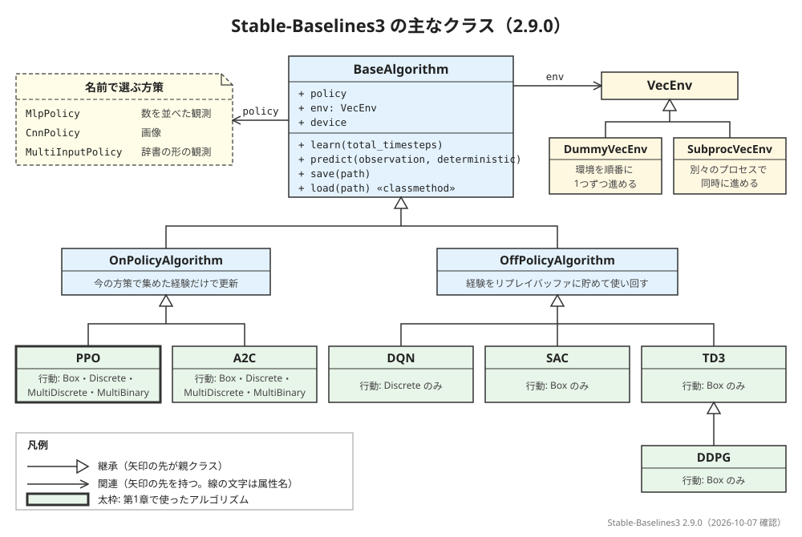

# 概要資料：Stable-Baselines3

第1章では、`PPO("MlpPolicy", env)` と `learn()` の数行で、CartPole のエージェントを学習させました。この資料は、そのとき使った **Stable-Baselines3**（以下 SB3）の全体像をまとめた「地図」です。どんなアルゴリズムがそろっていて、どの章でどれを使うのか、学習・保存・評価の操作がどうつながっているのかを見渡します。

- **前提**: [第1章 動かして楽しむ](../chapters/ch01_first_training/ch01_first_training.ipynb)と[第2章](../chapters/ch02_gymnasium_api/ch02_gymnasium_api.ipynb)を終えていること
- **所要の目安**: 読むだけで 10 分ほど（コードの実行はありません）

> **注記**: クラスの関係・対応する行動の空間・既定値は、導入した Stable-Baselines3 2.9.0 のソースで確かめたものです（2026-10-07 確認）。

## 0. この資料で分かること

1. SB3 がどんなライブラリか
2. SB3 に入っているアルゴリズムと、それぞれが扱える行動の種類、この教科書で使う章
3. 学習・予測・保存・評価の操作のつながり
4. 方策・コールバック・ベクトル化環境・装置（`device`）の役割

## 1. 全体像

図の左上の「名前で選ぶ方策」は、クラスではなく、モデルを作るときに文字列で渡す方策の名前の一覧です（5節）。図は、Stable-Baselines3 2.9.0 のソースで確かめた関係だけを描いています。

SB3 のアルゴリズムは、どれも `BaseAlgorithm` というクラスを親に持ちます。そのすぐ下で、**方策オン**（`OnPolicyAlgorithm`）と**方策オフ**（`OffPolicyAlgorithm`）の2つの系統に分かれます。

- **方策オン**: 今の方策で集めたばかりの経験だけを使って、方策を改めます。改めたら、その経験は捨てて、また集め直します。第1章の PPO はこちらです
- **方策オフ**: 集めた経験を「経験の貯め場所」（リプレイバッファ）に貯めておき、過去の経験も繰り返し使って学習します。DQN や SAC はこちらです

どちらの系統でも、使い方（`learn()`・`predict()`・`save()`・`load()`）は同じです。

## 2. Stable-Baselines3 とは

SB3 は、強化学習のアルゴリズムを、信頼できる形で実装したライブラリです。公式の文書は、SB3 を「PyTorch による、強化学習のアルゴリズムの信頼できる実装の集まり」で、「Stable Baselines の次の大きな版」と説明しています。内部の計算には PyTorch を使います（[PyTorch の概要資料](pytorch.md)）。

## 3. アルゴリズムの一覧

SB3 2.9.0 の本体に入っているアルゴリズムは、次の6つです（このほかに、HER という手法が、リプレイバッファの形で入っています）。**行動の種類**の列は、そのアルゴリズムが扱える行動の空間です（`Discrete` は「いくつかの中から1つを選ぶ」、`Box` は「連続の値」。[Gymnasium の概要資料](gymnasium.md)の4節）。

| アルゴリズム | 系統 | 扱える行動の種類 | この教科書で使う章 |
|---|---|---|---|
| PPO | 方策オン | `Box`・`Discrete`・`MultiDiscrete`・`MultiBinary` | 第1章（済み）、第11章 LunarLander（予定） |
| A2C | 方策オン | `Box`・`Discrete`・`MultiDiscrete`・`MultiBinary` | 第8章 CartPole（済み。自作の REINFORCE のサンプルと比べる） |
| DQN | 方策オフ | `Discrete` だけ | 第7章 CartPole（済み。自作の解説用サンプルと比べる） |
| SAC | 方策オフ | `Box` だけ | 第10章 Pendulum（予定） |
| TD3 | 方策オフ | `Box` だけ | 第10章 Pendulum（予定） |
| DDPG | 方策オフ（TD3 を受け継ぐ） | `Box` だけ | 第10章 Pendulum（予定） |

DQN は行動が連続の値の環境（Pendulum など）では使えず、SAC・TD3・DDPG は行動が「左か右か」のような環境（CartPole など）では使えません。環境の行動の空間を見れば、使えるアルゴリズムが絞れます。

SB3 には、表形式の手法（価値反復・Q学習など）や、もっとも基本的な方策勾配法の REINFORCE は入っていません。そのため、この教科書では、第3〜6章（表形式）は NumPy の解説用のサンプルを用意して扱いました。第8章（REINFORCE）は、PyTorch の解説用のサンプルを用意して扱いました。

## 4. 学習・予測・保存・評価

第1章の流れを、操作ごとに並べると次のとおりです。

| 操作 | 書き方の例 | 役割 | 第1章では |
|---|---|---|---|
| モデルを作る | `PPO("MlpPolicy", env, seed=0)` | アルゴリズムと方策の形を決めて、学習前のモデルを作る | 3節 |
| 学習させる | `model.learn(total_timesteps=30_000)` | 環境を指定の回数だけ進めながら、方策を改める | 4節 |
| 行動を選ばせる | `model.predict(observation, deterministic=True)` | 観測を見せて、行動を選ばせる | 3節・5節 |
| 成績を測る | `evaluate_policy(model, env, n_eval_episodes=10)` | 何回かエピソードをさせて、報酬の合計の平均とばらつきを返す | 5節 |
| 保存する | `model.save("ppo_cartpole")` | 学習したモデルをファイルに保存する | 使っていない |
| 読み込む | `PPO.load("ppo_cartpole")` | 保存したモデルを読み込む（クラスから呼ぶ） | 使っていない |

`save()` と `load()` は、長い学習を途中で保存しておくときや、学習中の一番よい時点のモデルを残すときに使います。[第7章](../chapters/ch07_cartpole_dqn/ch07_cartpole_dqn.ipynb)では、`EvalCallback`（5節）が中で `save()` を使って保存した一番よい時点のモデルを、`DQN.load()` で読み込みました。

**ベクトル化環境（`VecEnv`）**: SB3 は、環境を自分のベクトル化環境の形にして扱います。`PPO` に1つの環境を渡すと、SB3 は内部で、その環境がまだ `Monitor` で包まれていなければ `Monitor` で包み、さらに `DummyVecEnv`（環境を順番に1つずつ進める `VecEnv`）で包みます。第1章では、自分で `Monitor` に包んだ環境（`train_env`）を渡していたので、内部で加わったのは `DummyVecEnv` だけです。第1章の 5-1節で使った `make_vec_env()` も、同じ形の環境を作る関数です。環境を別々のプロセスで同時に進める `SubprocVecEnv` もあります。

## 5. 方策・コールバック・装置

**方策**（policy）は、PPO などの中で、観測から行動を決めるニューラルネットワークです。SB3 では、名前で形を選びます。

| 名前 | 向いている観測 |
|---|---|
| `MlpPolicy` | 数を並べた観測（CartPole の4つの数など）。全結合のネットワーク |
| `CnnPolicy` | 画像の観測。畳み込みのネットワーク |
| `MultiInputPolicy` | 辞書の形の観測（いくつかの種類の観測を組み合わせたもの） |

**コールバック**は、学習の途中で、決まった時機に自分の処理を差し込む仕組みです。たとえば `EvalCallback` は、一定の間隔で成績を測ります（間隔の `eval_freq` は、環境を進める呼び出しの回数で数えます。いくつかの環境をまとめて進めるときは、1回の呼び出しで環境の数だけステップが進みます。[第8章](../chapters/ch08_cartpole_reinforce/ch08_cartpole_reinforce.ipynb)の3-1節）。保存先（`best_model_save_path`）を指定すると、いちばん成績が良かったときのモデルを保存します。`CheckpointCallback` は、一定のステップごとにモデルを保存します。第1章 7節で見たように、学習の途中では方策が良くなったり少し悪くなったりを繰り返すので、その対策として、[第7章](../chapters/ch07_cartpole_dqn/ch07_cartpole_dqn.ipynb)で `EvalCallback` を使いました。

**装置**（`device`）の既定は `"auto"` で、GPU を使えれば GPU、使えなければ CPU を選びます。ただし公式の文書は、PPO は、画像を扱う畳み込みのネットワーク（CNN）を使わない場合、主に CPU で動かすことを想定していると説明しています。第1章で `device="cpu"` と明示したのは、そのためです。

## 出典

この資料は、次の公式の文書と、導入した Stable-Baselines3 2.9.0 のソース（2026-10-07 確認）をもとに、著者の言葉でまとめたものです。逐語の転載ではありません。

- Stable-Baselines3 Documentation: https://stable-baselines3.readthedocs.io/en/master/
- Stable-Baselines3 Documentation, PPO: https://stable-baselines3.readthedocs.io/en/master/modules/ppo.html
- Stable-Baselines3 のソース（v2.9.0。`stable_baselines3/common/base_class.py` の `_wrap_env` など）: https://github.com/DLR-RM/stable-baselines3/tree/v2.9.0/stable_baselines3

図と文章のライセンスは、リポジトリの [LICENSE.md](../LICENSE.md) を見てください。
